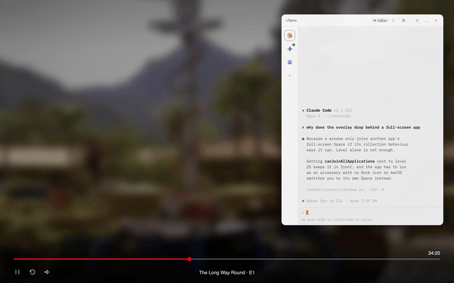
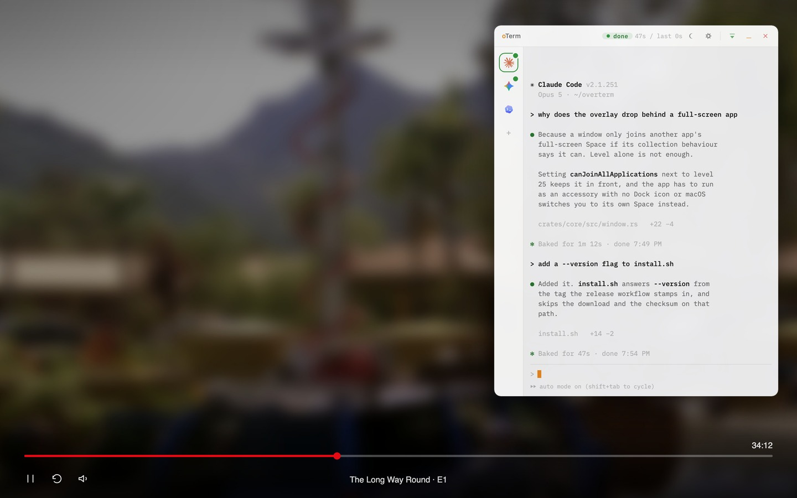

# oTerm

**A terminal that knows when your AI agent needs you.**

Run Claude Code, Codex, Gemini CLI or any other command line tool in a
small terminal that floats above everything else. While the agent works,
oTerm shrinks to a status bar and stays out of your way so that you can
watch your favourite show while your agent works. The moment it
finishes or asks a question, the terminal shows up on its own, without
you needing to keep alt+tab-ing to check if the task is finished.



*It collapses when you hand it a job and comes back when the answer is
ready. The video never gets paused or covered.*

> macOS 11 or newer. Free and open source, MIT licensed.

## Install / Update

```sh
curl -fsSL https://raw.githubusercontent.com/egeyesss/overterm/main/install.sh | sh
```

That's all. You can run that line to install or update the outdated oTerm you already have.
It puts `oTerm.app` in your Applications folder, 
and once you run it one time from there, you can pin it to your dock and 
open it from there or Applications folder.
After that, you can open it by the small terminal icon in the menu bar.
You can show/hide the terminal with `Cmd+Shift+O` after that.

There is no Dock icon on purpose. macOS gives an app with a Dock icon
a desktop of its own and switches you to it, which
would stop the window appearing over a full-screen video.

Piping a script into a shell is a lot to ask of anybody, so read it first
if you would rather:

```sh
curl -fsSLO https://raw.githubusercontent.com/egeyesss/overterm/main/install.sh
less install.sh
sh install.sh
```

## Uninstall

```sh
curl -fsSL https://raw.githubusercontent.com/egeyesss/overterm/main/uninstall.sh | sh
```

### Why am I asking you to run a script?

The app is not signed with an Apple Developer certificate, which costs $99/yr, and
I am broke so I don't want to spend money on that for a side project.
Without one the app cannot be notarised, and macOS refuses to open an app
it cannot check for malware when the file carries the
`com.apple.quarantine` attribute.

That attribute is set by whatever downloaded the file. Browsers set it and
Homebrew sets it. `curl` does not, so an app it downloads is never
quarantined and opens normally.

This gets around the check rather than passing it.
What you do get is that every release is built by a GitHub Actions workflow that lives here,
and the logs are all public. The script also checks the download against the
checksum published beside it, which catches a file that arrived damaged.

### Homebrew

If you would rather use a package manager, the cask needs a second command
because Homebrew quarantines what it downloads:

```sh
brew install --cask egeyesss/overterm/overterm
xattr -dr com.apple.quarantine /Applications/oTerm.app
```

> On macOS 15 and later, right-clicking an app to open it stopped working as a way around this, so the `xattr` line is what you need.

### macOS asking for your Desktop folder

macOS charges a command's file access to the app that owns the terminal, so
a session that reads or writes something on your Desktop looks like oTerm
reading and writing it. The first time that happens macOS asks, the same
way it asks for Terminal and iTerm.

The bundle carries an ad-hoc signature, which ties your answer to a hash of
the build. Answering once holds for as long as that build is installed, and
a new release has a different hash, so the question comes back once after
each update. A Developer ID certificate is what would stop that, because
the answer would follow the certificate and survive a rebuild.

## What it does

**It works out what your agent is doing.** Idle, working, finished, or
waiting on an answer, with nothing to install and no cooperation from the
tool. It reads the terminal the way you would, so it works with a CLI it
has never heard of. **Claude Code and Pi get better than a guess**, because
both can be made to say exactly what happened. The sections below cover
how.

**It gets out of the way, then comes back.** Hand a session a job and the
window shrinks to a status bar showing what it is doing, where, and for
how long. When the agent finishes or hits a question, the terminal
returns. It never takes keyboard focus doing that, so it cannot eat a
keystroke meant for the window you were actually using.


**It stays where you can see it.** Always on top, on every Space,
including over another app's full-screen window.



**Several agents at once.** Each session gets a tab, labelled with
whichever tool is running in it and carrying its own status dot, so you
can see which one wants you without switching. The window only tucks
itself away once **every session** is busy.

**It is a real terminal.** A real PTY, so full colour interactive
interfaces work untouched. Find, clickable links, **GPU rendering**, correct
emoji widths, and Shift+Enter for a multi-line prompt.

**It is yours to arrange.** Light and dark or follow the system, drag any
edge to resize, three size presets, adjustable transparency, font,
scrollback and summon shortcut. Everything applies without a restart.

### Shortcuts

| Keys | What it does |
|---|---|
| `Cmd+Shift+O` | Summon or hide oTerm from anywhere |
| `Cmd+F` | Find in the scrollback |
| `Cmd+,` | Settings |
| `Shift+Enter` | New line in a prompt instead of submitting |
| `Cmd+K` | Clear the terminal |
| `Cmd+plus` and `Cmd+minus` | Font size |

## Claude Code

Reading the terminal works for every tool and is still a guess. Claude
Code can say exactly what happened, so on first launch oTerm adds four
hook entries to `~/.claude/settings.json`: a prompt being submitted, a
turn finishing, a turn failing, and a permission prompt appearing. It
tells you the first time it does this.

Each entry is a single `printf` that prints a fixed piece of JSON and
exits. Claude Code turns that into an escape sequence in the terminal, and
oTerm reads it back out of the session it arrived on. Nothing listens on a
port, there is no token to handle, and it works over SSH.

The entries merge into whatever hooks you already have and go in once.
There is a switch for them in the settings, which is also how to put them
back if you removed them. Deleting the four entries whose command mentions
`overterm` works too, and oTerm will not add them again. Detection falls
back to reading the terminal, which is what every other tool gets.

## Pi

[Pi](https://pi.dev) can report itself too, through its extensions rather
than through hooks, so on first launch oTerm writes one file to
`~/.pi/agent/extensions/overterm.js`. Pi loads any extension it finds
there. The file subscribes to three of Pi's events and writes the same
escape sequence the Claude Code hooks produce.

It has to write that sequence itself, because Pi gives an extension no way
to hand the terminal a string and owns stdout for its own interface. So
the extension opens `/dev/tty` and writes there directly. Subagents stay
quiet, since Pi runs those as separate processes on the same terminal and
their turns are not the session's turns.

Same switch in the settings, and deleting the file works and sticks.

## Built with

- **Tauri v2** for the app shell, because an always-on-top terminal has no
  business using 200 MB of RAM
- **Rust** for PTY sessions and the detection state machine, in a core
  crate with no UI dependencies at all
- **xterm.js** for the terminal itself
- **objc2** for the AppKit calls a floating overlay needs, behind a single
  trait so a Windows or Linux port has one file to write

## Contributing

Two things are worth picking up first. Teaching oTerm to recognise a tool
it does not know yet is two lines of config, and a Windows or Linux port
has all of its platform code behind one trait. See
[CONTRIBUTING.md](CONTRIBUTING.md) and [PORTING.md](PORTING.md).

```sh
npm install                  # the Tauri CLI
npm install --prefix app/ui  # the frontend
npm run tauri dev            # build and run
cargo test                   # the tests
```

Tests spawn real shells in real PTYs and replay recorded terminal
transcripts, so they are slower than mocks and way more honest.

```
crates/core   PTY sessions, agent state detection, window rules
app/src       Tauri setup, native window behaviour, the PTY bridge
app/ui        the xterm.js terminal, the tab rail and the collapsed bar
```

## License

MIT. See [LICENSE](LICENSE) and [NOTICE.md](NOTICE.md).
